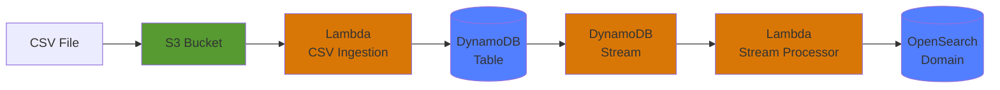

# DynamoDB Stream to OpenSearch

## Goal

Real-time data sync pipeline: DynamoDB changes automatically indexed to OpenSearch via DynamoDB Streams. Combines fast key-value lookups (DynamoDB) with full-text search (OpenSearch).

## Architecture

## Improvements

More infos: https://github.com/klemjul/aws-labs-collection/pull/7

- [ ] go: Improve error handling in the stream code
- [ ] tf: Better IAM restrictions
- [ ] tf: OpenSearch Advanced IAM security
- [ ] tf: Improve build null_resource trigger condition
