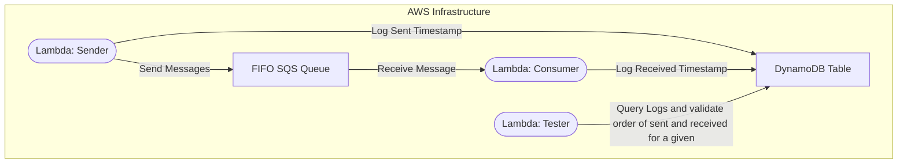
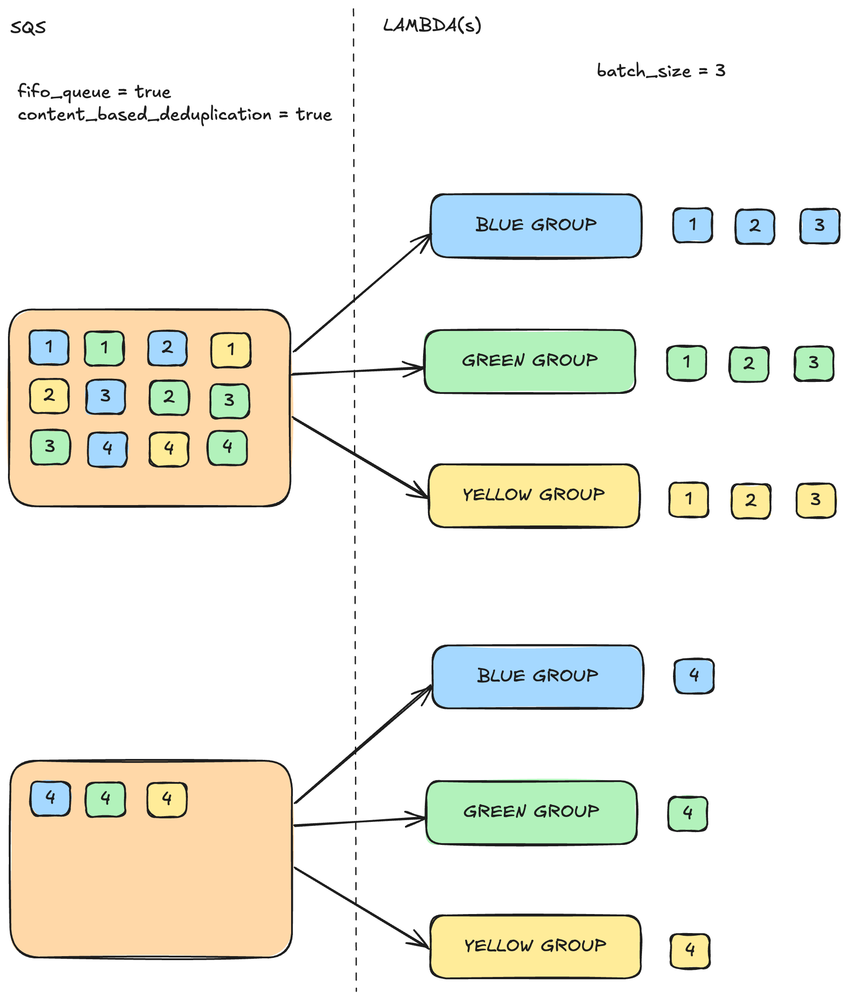

# Message Regrouping Proof of Concept
This project demonstrates how SQS FIFO can be used to allow parallel processing while maintaining order within different message groups. This POC uses a message delivery system for different chat rooms, messages must be processed in order within each chat room.

