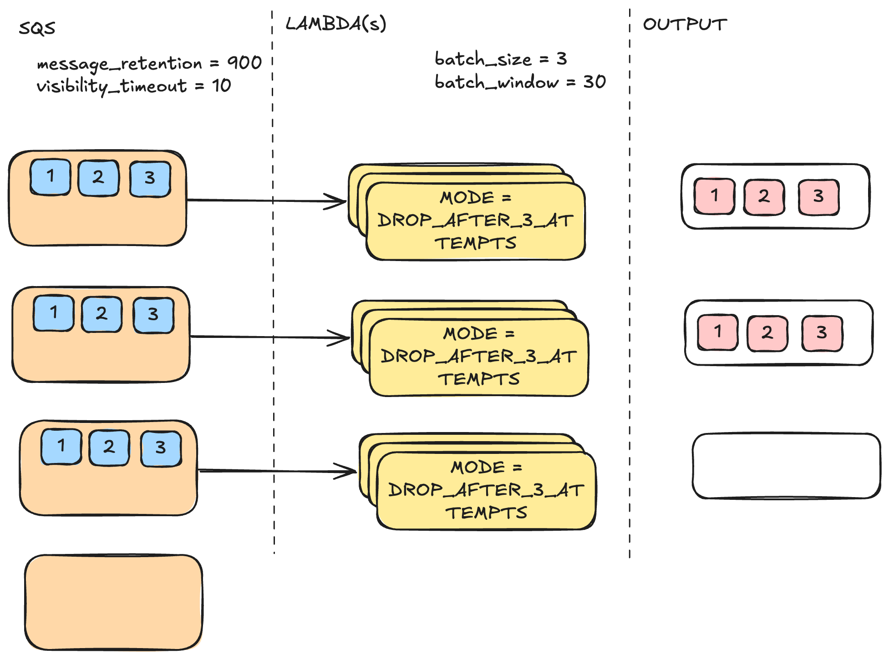

# Message Reprocessing Proof of Concept

This project demonstrates message reprocessing in a queue with various failure scenarios.

Sender lambda can be invoked directly from the AWS Console or using AWS CLI.

## Differents Demos

Demo mode can be configured using [variables.tf](./variables.tf) `demo_mode`

### NONE

### THROW

### PARTIAL_FAILURE

### DROP_AFTER_3_ATTEMPTS

### DLQ_AFTER_2_ATTEMPTS

### IMMEDIATE_REPROCESSING
